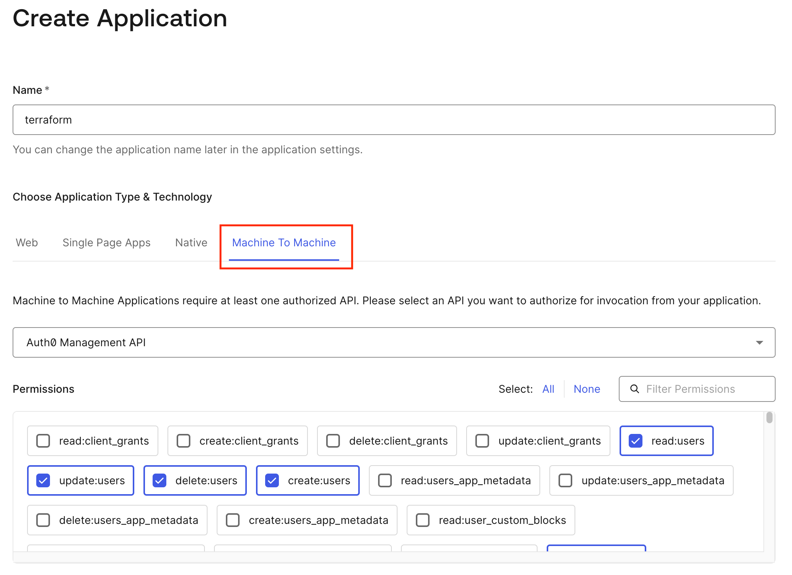
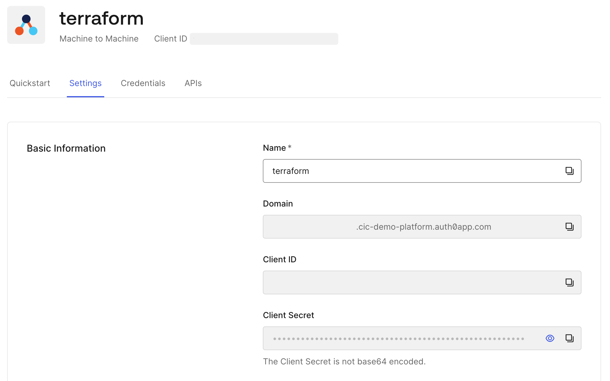
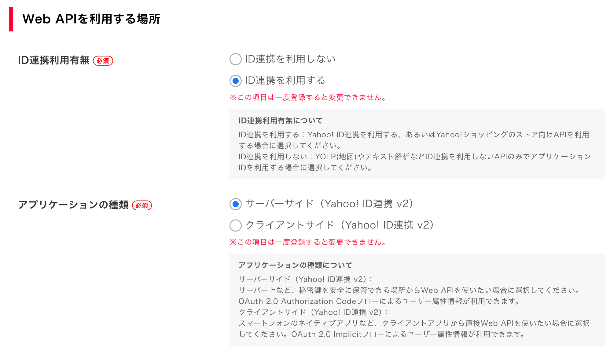
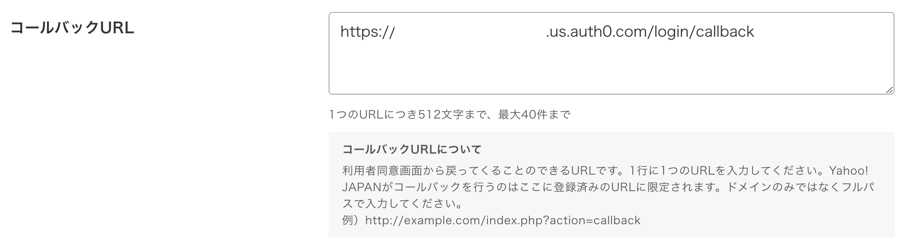
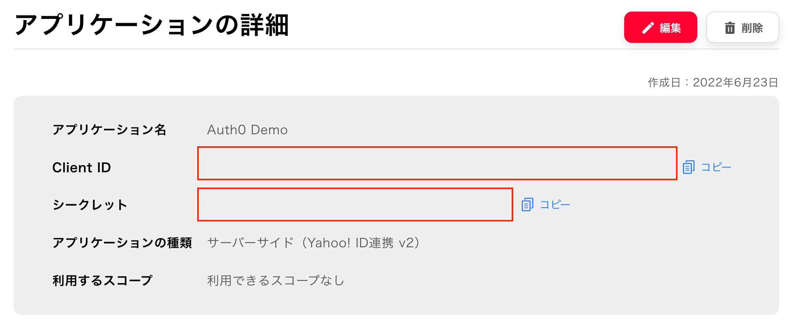
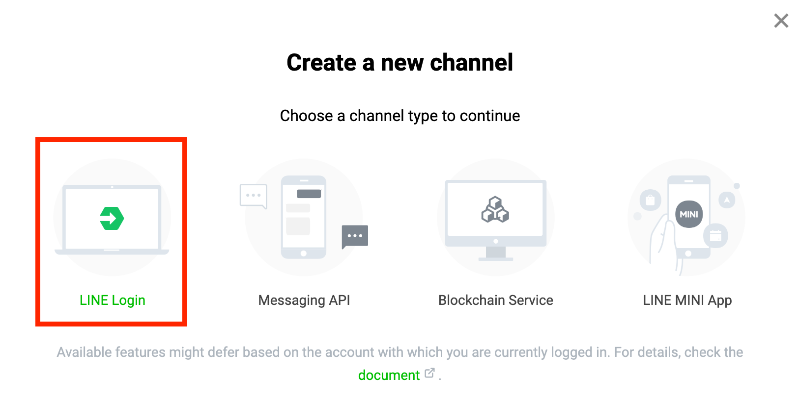
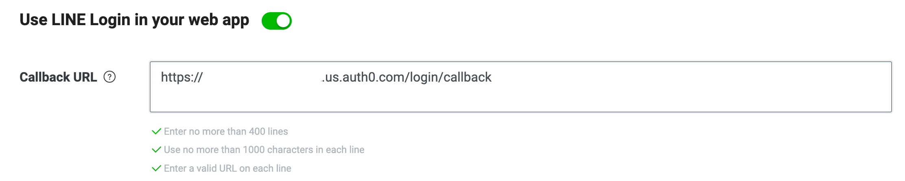
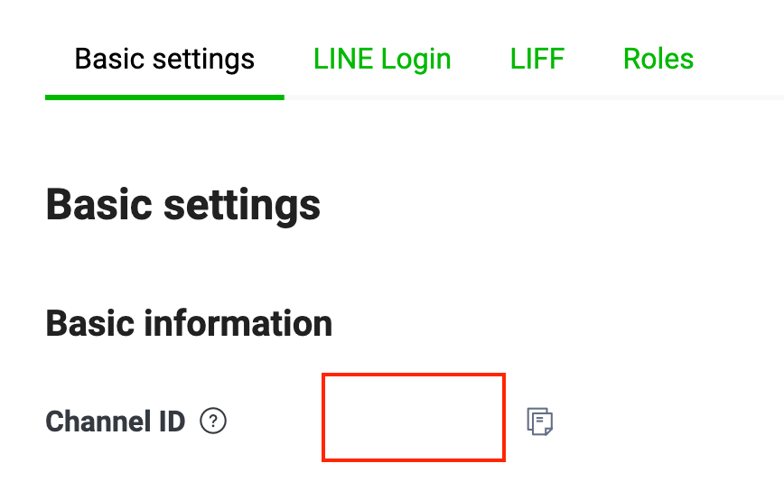
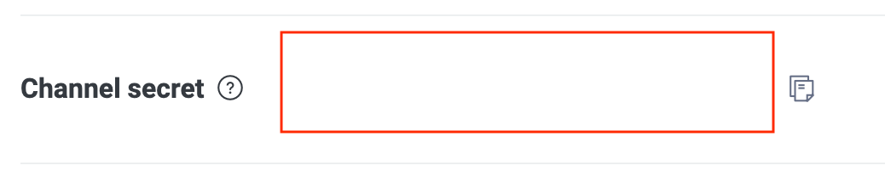

# 概要

TerraformでAuth0のリソースを管理するためのデモワークショップ

## 作成される主なリソース

| リソース | 説明 | モジュール |
| --- | --- | --- |
| ユーザー | Auth0ユーザーを複数作成（Attributeや人数は変数で指定） | [auth0_user.tf](modules/common/auth0_user.tf) |
| コネクション | LINE, Yahoo!Japan (Custom) を作成 | [auth0_connection.tf](modules/common/auth0_connection.tf) |
| Actions | `user_metadata` に基づいてMFA要否を判定するPost Login処理 | [auth0_actions.tf](modules/common/auth0_actions.tf) |

## フォルダ/ファイル構成

| フォルダ | 概要 |
| --- | --- |
| [modules](./modules) | モジュール（ユーザー作成等の共通処理）を格納 |
| [actions](./actions) | Actionsスクリプトを格納 |
| [connections](./connections) | 各Connectionでユーザープロファイルを取得する等のスクリプト |
| [tenant](./tenant) | Auth0テナントごとのフォルダを格納 |
| [tenant/template](./tenant/template) | テナントフォルダのコピー元テンプレート |

```
auth0
├── README.md
├── actions
│   └── <Actionsスクリプト>.js
├── connections
│   └── <Connectionで用いるスクリプト>.js
├── modules
│   └── common
│       └── <各種構成ファイル>.tf
└── tenant
    ├── <Auth0テナント名（各自templateからコピーして作成）>
    │   ├── example.tfvars
    │   ├── <Auth0テナント名>.tfvars
    │   ├── main.tf
    │   └── variables.tf
    └── template
        ├── example.tfvars
        ├── main.tf
        └── variables.tf
```


# 使い方

## 事前準備

### 1. Auth0管理コンソールでM2Mアプリケーションを作成

#### 1-1. Machine to Machineアプリケーションを作成



#### 1-2. 使用するAPIとスコープを指定

| **API** | **Scope** |
| --- | --- |
| `Auth0 Management API` | `read:user` `update:user` `delete:user` `create:user` `read:action` `update:action` `delete:action` `create:action` `read:connection` `update:connection` `delete:connection` `create:connection` |

#### 1-3. 生成される `Domain` `Client ID` `Client Secret` を控えておく




### 2. テナント用のterraform設定をテンプレートからコピー

```bash
cp -p -r tenant/template tenant/<Auth0テナント名>
```

## リソースを展開

### 3. 変数ファイルを編集

```bash
# テナント用のディレクトリに移動
cd tenant/<Auth0テナント名>

# テナント用の変数ファイルをテンプレートからコピー
cp -p example.tfvars <Auth0テナント名>.tfvars

# 変数ファイルを編集
vim <Auth0テナント名>.tfvars
```

#### <Auth0テナント名>.tfvars

```hcl
# Auth0 Provider Settings
domain        = "yourtenant.us.auth0.com"
client_id     = "abc*****************************"
client_secret = "****************************************************************"

# User Settings
demo_users = [
  {
    email        = "taro.yamada@example.com"
    given_name   = "Taro"
    family_name  = "Yamada"
    user_metadata = {
      require_mfa = true
    }
    app_metadata = {
      subscription = "enterprise"
    }
  },
  {
    email        = "ichiro.suzuki@example.com"
    given_name   = "Ichiro"
    family_name  = "Suzuki"
    user_metadata = {
      require_mfa = false
    }
    app_metadata = {
      subscription = "pro"
    }
  },
  {
    email        = "hanako.tanaka@example.com"
    given_name   = "Hanako"
    family_name  = "Tanaka"
    user_metadata = {
      require_mfa = false
    }
    app_metadata = {
      subscription = "free"
    }
  }
]
demo_user_password  = "***********"
database_connection = "Username-Password-Authentication"

# Social Connection
# Yahoo! Japanデベロッパーコンソール (https://e.developer.yahoo.co.jp/) でアプリケーションを作成
yahoo_japan_client_id     = "dj0*****************************************************"
yahoo_japan_client_secret = "****************************************"
yahoo_japan_icon_url      = "https://d32pddnyyfo4fv.cloudfront.net/public/yahoo_japan_logo.png"

# LINE Developerコンソール (https://developers.line.biz/) でLINE Loginのchannelを作成
line_client_id     = "16********"
line_client_secret = "********************************"

```

<details>

<summary>Yahoo! Japanデベロッパーコンソール</summary>

#### サーバーサイドアプリケーションを指定



#### コールバックURLには `https://AUTH0_DOMAIN/login/callback` を設定



#### クライアントIDとシークレットを `.tfvars` に設定



</details>

<details>

<summary>LINEデベロッパーコンソール</summary>

#### LINE LoginのChannel作成



#### コールバックURLには `https://AUTH0_DOMAIN/login/callback` を設定



#### Channel IDとシークレットを `.tfvars` に設定

  


</details>

### 4. Auth0 Providerをインストール

```bash
terraform init
```

### 5. リソースをデプロイ

```bash
terraform apply -var-file=<Auth0テナント名>.tfvars
```

## リソースを破棄

```bash
terraform destroy -var-file=<Auth0テナント名>.tfvars
```
