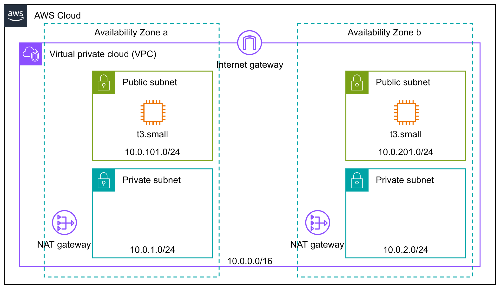

# 概要

TerraformでAWSのリソースを管理するためのデモワークショップ

## 作成される主なリソース

| リソース | 説明 | モジュール |
| --- | --- | --- |
| VPC | CIDR `10.0.0.0/16` のVPCをデプロイ | [vpc.tf](vpc.tf) |
| Subnet | 各AZにPublic Subnet, Private Subnetをデプロイ | [subnet.tf](subnet.tf) |
| Security Group | EC2にアタッチするSecurity Group | [security_group.tf](security_group.tf) |
| AMI | Windows, LinuxのAMI | [ami.tf](ami.tf) |
| Keypair | Windows, LinuxそれぞれのPublic key / Private keyを作成 | [keypair.tf](keypair.tf) |
| EC2 | WindowsおよびNode.js用Linuxインスタンス | [ec2_windows.tf](ec2_windows.tf), [ec2_nodejs.tf](ec2_nodejs.tf) |

### トポロジー



# 使い方

## リソースを展開

### 1. 各Providerをインストール

```bash
terraform init
```

### 2. 変数ファイルを編集

```bash
cp -p example.tfvars my_variables.tfvars
vim my_variables.tfvars
```

#### my_variables.tfvars

```hcl
# Provider settings
region     = "ap-northeast-1". # 東京リージョン
access_key = "AKI*****************"  # AWS Console AMIでユーザー作成してキー発行
secret_key = "****************************************"  # AWS Console AMIでユーザー作成してキー発行

# Common Settings
prefix        = "kikeyama"  # EC2インスタンス等につける任意の名前prefix
email         = "kikeyama@example.com"  # 自分のメアド（タグに入れるだけ）

# Instance settings
key_name      = "kikeyama-terraform-workshop-key"  # SSH鍵の名前
key_file_path = "/Users/kikeyama/aws"  # SSH鍵の格納フォルダ
home_cidr     = "123.45.6.78/32"  # whatismyip.comで確認
```

### 3. リソースをデプロイ 

```
terraform apply -var-file=<2.で編集したtfvarsファイル名>
```

## リソースを破棄

```bash
terraform destroy -var-file=<2.で編集したtfvarsファイル名>
```
