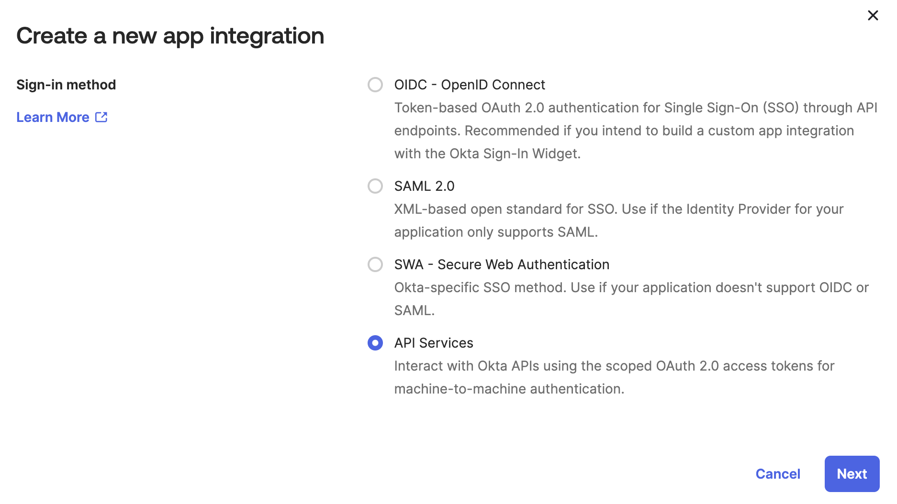
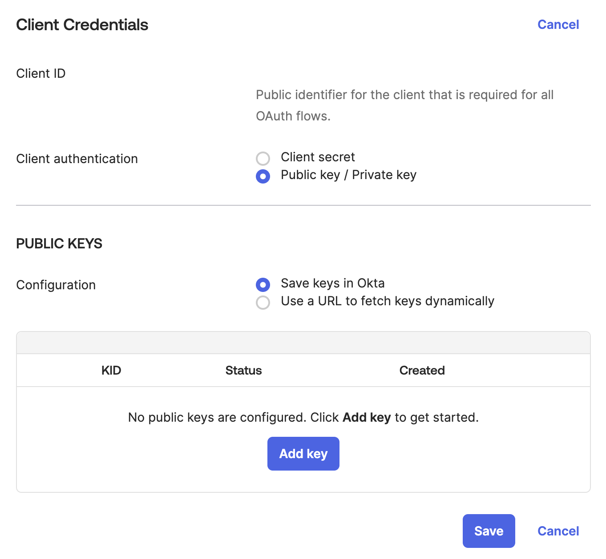
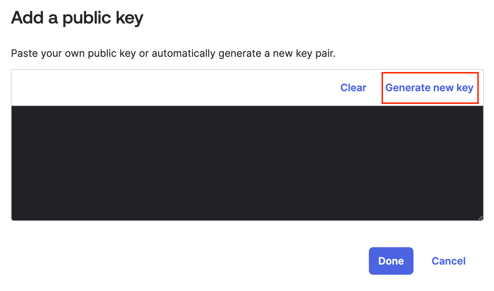
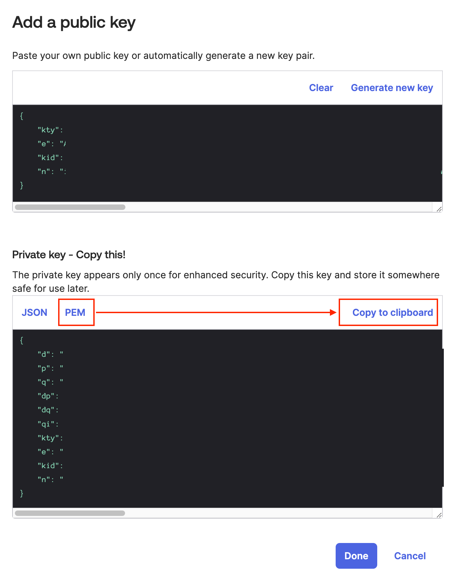
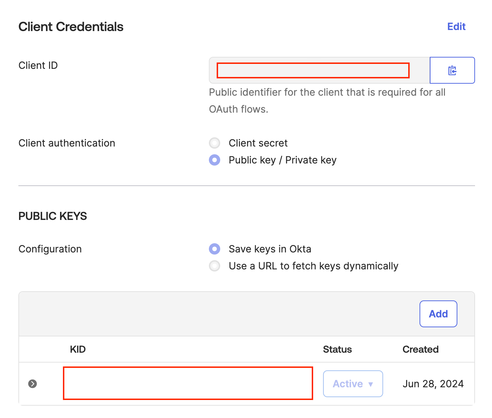
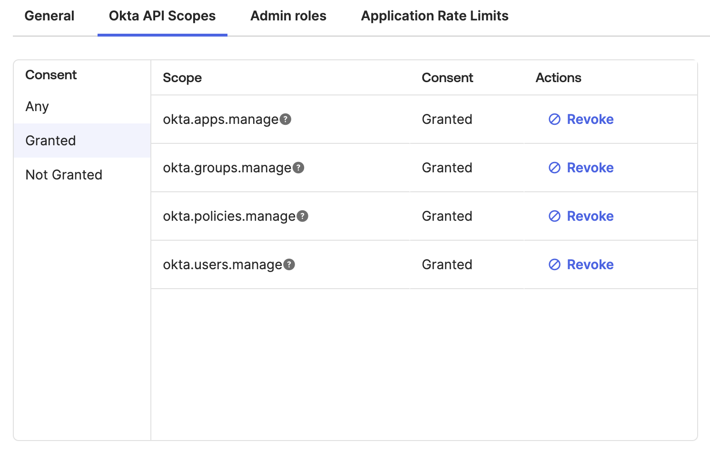
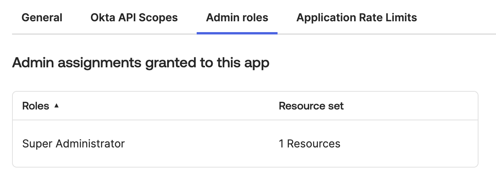

# 概要

TerraformでOktaのリソースを管理するためのデモワークショップ

## 作成される主なリソース

| リソース | 説明 | モジュール |
| --- | --- | --- |
| ユーザー | Oktaユーザーを複数作成（Attributeや人数は変数で指定） | [okta_user.tf](modules/okta_user.tf) |
| グループ | グループを作成（詳細は下表） | [okta_group.tf](modules/okta_group.tf) |
| アプリケーション | 変数 `app_count` で指定した数のOAuth Appを作成 | [okta_app.tf](modules/okta_app.tf) |
| 認証ポリシー | 認証ポリシーおよび `Contractor` グループ用のルールを作成してアプリケーションをアサイン | [okta_app_signon_policy.tf](modules/okta_app_signon_policy.tf) |


### 作成されるグループとアサイン

| グループ名 | メンバーアサイン |
| --- | --- |
| `Demo Terraform` | 全員を直接アサイン |
| `Sales` | グループルール `Sales members` - Departmentが `Sales` のメンバーをアサイン |
| `Contractor` | グループルール `Contractors` - User typeが `Contractor` のメンバーをアサイン |


# 使い方

## 事前準備

### 1. Org用のterraform設定をテンプレートからコピー

```bash
cp -p -r org/template org/<Okta org名>
```

### 2. Okta管理コンソールでアプリケーションを作成

#### 2-1. API Serviceアプリケーションを作成



#### 2-2. クライアント認証方式を Public key / Private key にする



#### 2-3. 鍵を作成



#### 2-4. Private key (PEM) をコピーして `./org/<Okta org名>/keys` フォルダに保存



#### 2-5. Client IDとKID (Key ID)を控える（後のステップで変数に設定）



#### 2-6. General Settings欄にある `Proof of possession` のチェックを外す


#### 2-7. Okta API Scopesタブで必要なスコープを設定



#### 2-8. Admin roleタブで `Super Administrator` を追加



## リソースを展開

### 3. 変数ファイルを編集

```bash
cd org/<Okta org名>
cp -p example.tfvars <Okta org名>.tfvars
vim <Okta org名>.tfvars
```

```hcl
# Okta Provider Settings
okta_org_name             = "myorg"
okta_base_url             = "okta.com"
okta_api_client_id        = "0o******************"
okta_api_private_key_path = "./keys/api_app_terraform.pem"
okta_api_private_key_id   = "*******************************************"

# User Settings
demo_user_password = "************"
okta_users = [
  {
    email      = "taro.yamada@example.com"
    first_name = "Taro"
    last_name  = "Yamada"
    department = "Sales"
    user_type  = "Employee"
  },
  {
    email      = "ichiro.suzuki@example.com"
    first_name = "Ichiro"
    last_name  = "Suzuki"
    department = "Engineering"
    user_type  = "Employee"
  },
  {
    email      = "hanako.tanaka@example.com"
    first_name = "Hanako"
    last_name  = "Tanaka"
    department = "Finance"
    user_type  = "Contractor"
  }
]

# App Settings
app_count = 2
```

### 4. Okta Providerをインストール

```bash
terraform init
```

### 5. リソースをデプロイ

```bash
terraform apply -var-file=<Okta org名>.tfvars
```

## リソースを破棄

```bash
terraform destroy -var-file=<Okta org名>.tfvars
```
